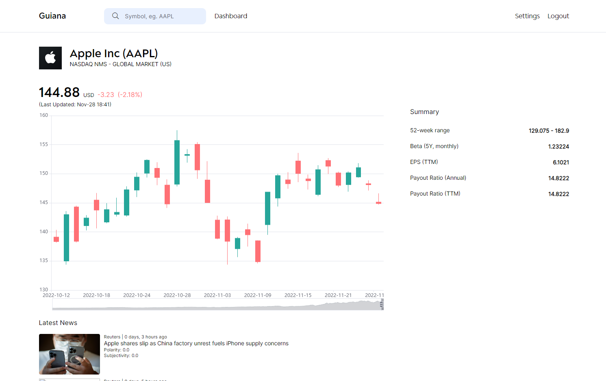

<h1 align="center">Guiana Chestnut</h1>
<p align="center">A stock screener web application built for analysing financial instruments and personal use.</p>
<p align="center">Previous iterations: <a href="https://github.com/jhtkoo0426/Okane">Okane</a></p>

     

<hr>



## Introduction
Guiana Chestnut (Money Tree) is my most ambitious project so far that combines multiple technologies that I have acquired so far, from full-stack web development to stock analysis. 

**Why re-invent the wheel when so many screening services are available?** The main is I hope that this project can demonstrate my skillset through developing an end-to-end system, built using highly-transferrable skills such as using APIs, data collection & analysis, unit testing & refactoring, and much more.

The commit history to Guiana should be relatively new. This is because Guiana is built based on several other smaller projects that I've done, including:
- <a href="https://github.com/jhtkoo0426/Okane">Okane</a> that focuses solely on interacting with an online stock broker
- <a href="https://github.com/jhtkoo0426/Guiana-Chestnut-Algos">Guiana Chestnut Algos</a> that focuses on integrating machine learning techniques into fundamental and technical analysis of stocks, such as sentiment analysis and time series forecasting.

These skills, together with self-taught full-stack development and development cycle concepts, helped me built Guiana from scratch efficiently.

*Disclaimer: This project is currently not hosted on any website. Please contact me for use cases.

## Technologies used (so far)
- Programming languages: Python, HTML, CSS, JavaScript
- Frameworks & libraries: [Django](https://www.djangoproject.com), spacy
- APIs: [Finnhub.io](https://finnhub.io) 
- Database: MySQL
- Other skills: OOP, mixins

  
## Debugging
Sync database after making migrations:
```
python manage.py migrate --run-syncdb
```

## Unit Testing
Run unit tests
```
coverage run manage.py test
```

Generate coverage report
```
coverage html
```


## Todo
- [ ] Prevent access to login & register page when logged in
- [ ] Prevent access to login-only pages when not logged in
- [x] Refactor search results page into individual sections (overall, news, strategies pages should all be separated)


## Future features
- [x] News sentiment analysis (based on NLP)
- [ ] Simple time series forecasting for stock trends (overall trend only)
- [ ] Basic financials
- [ ] Extend platform to other financial instruments (crypto, etc.)
- [ ] Volume spread analysis

Ultimate goal: Indicator for high potential stocks using the above features